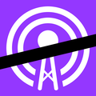

<p align="center">

  
  
</p>

# CastSnip
Taking snips of podcasts and posting them online

## History
I started this project back in the Fall of 2018 because there didn't seem
to be any way to make a short clip of a podcast to publish on social media.  I figured this might be a fun side project to help promote the
[Mostly Security](https://mostlysecurity.com) podcast I was co-hosting.  It turned into a little more than a side project and became "Eric's 
playground for learning about iOS features" - the biggest of which being an attempt to charge a subscription for using the app.

However, a short time after releasing the app, a couple of the heavy hitters in Podcast Players came out with a clip sharing feature - and since I really didn't want to compete as a podcast player or try to keep the app current, I removed it from the App Store, disappointing 3 or 4 people.

Now, here is it "open source".

*Note: Forked from original private repo with a bunch of stuff removed...*

## How to build
 * Clone Source
 * Install Carthage
   * `brew install carthage`
 * In the root directory, type `carthage build`
 * Go nuts...

## Scheme auto increment build number script
 * Go into Edit Scheme | Build | Post-actions
 * Run Script
 * Add the following:
 ```bash
PLIST="${PROJECT_DIR}/${INFOPLIST_FILE}"
PLB=/usr/libexec/PlistBuddy
LAST_NUMBER=$($PLB -c "Print CFBundleVersion" "$PLIST")
NEW_VERSION=$(($LAST_NUMBER + 1))
$PLB -c "Set :CFBundleVersion $NEW_VERSION" "$PLIST"
 ```

